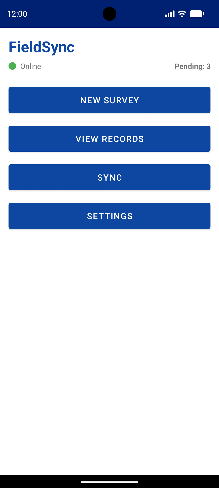
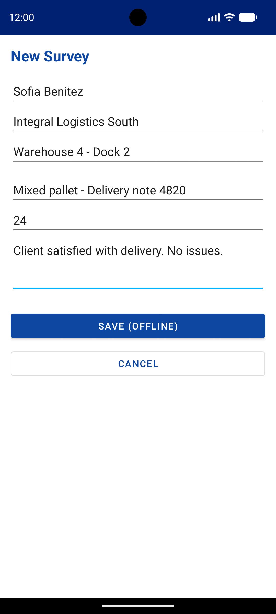
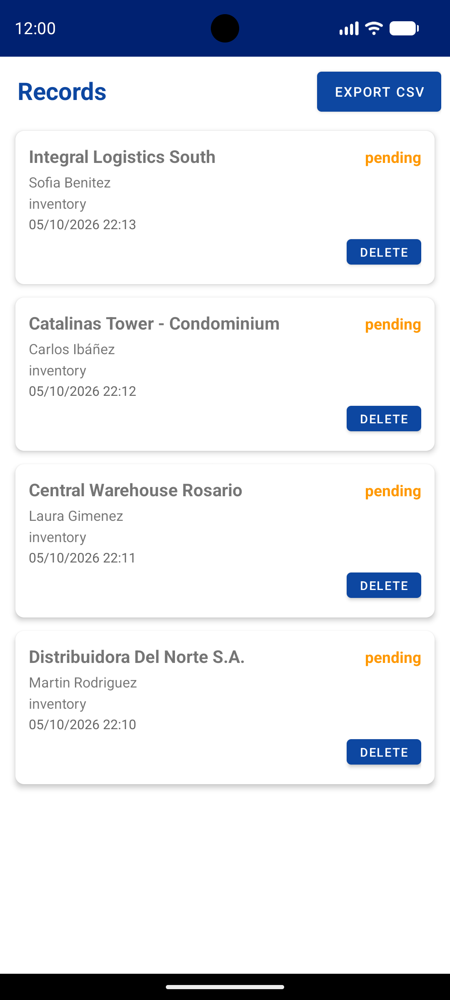
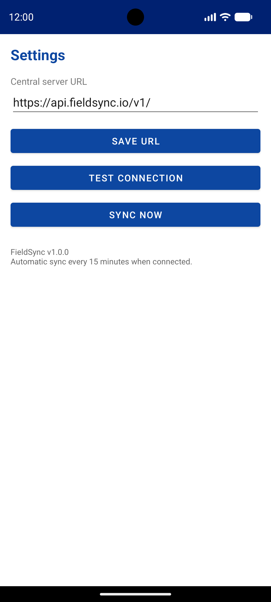

# FieldSync

**FieldSync** is an *offline-first* mobile platform and transactional synchronization engine for field operations, built in Kotlin for Android alongside a lightweight Node.js backend. Purpose-built to eliminate the bottlenecks faced by distributors, logistics centers, maintenance crews, and technical service companies, *FieldSync* replaces manual paper forms and error-prone transcribing with a resilient digital workflow that operates flawlessly in areas with no connectivity.

The system guarantees local transactional persistence through SQLite, background queuing governed by `WorkManager`, and idempotent two-way synchronization as soon as the device regains network signal, protecting the integrity of every record before consolidating it on the central server.

---

## 📸 Screenshots

<table align="center" style="border-collapse: collapse; border: 1px solid #333;">
  <tr>
    <td width="50%" align="center" style="padding: 6px; border: 1px solid #333;">
      
    </td>
    <td width="50%" align="center" style="padding: 6px; border: 1px solid #333;">
      
    </td>
  </tr>
  <tr>
    <td width="50%" align="center" style="padding: 6px; border: 1px solid #333;">
      
    </td>
    <td width="50%" align="center" style="padding: 6px; border: 1px solid #333;">
      
    </td>
  </tr>
</table>

## ✨ Key Features

* **Native Offline-First Architecture:** Every operation (order, inventory, audit, incident) is written immediately and atomically to the device's local SQLite database. The application never blocks the user interface and never fails during network outages.

* **Automatic Sync with WorkManager:** Periodic and reactive task queuing subject to connectivity constraints (`NetworkType.CONNECTED`). Upon detecting a network, the engine dispatches pending batches transparently in the background.

* **Transactional Integrity and Idempotency:** UUID-based unique identifiers generated on the client prevent duplicates on the central server. The engine marks confirmed records as synced locally only after receiving formal validation from the backend.

* **Manual Sync Override:** Instant dispatch button for operators finishing their shift who need to transfer data immediately before clocking out or moving to another zone.

* **On-Screen Record Auditing:** Built-in visual console that details the identifier, payload type, and synchronization status (`[PENDING]` vs `[SYNCED]`) in real time.

* **Enterprise Interoperability (REST API):** The central server exposes lightweight endpoints in Node.js and Express with SQL storage, enabling easy integration with existing ERP systems, warehouses, or control dashboards.

* **Energy and Data Efficiency:** The synchronization process handles only data deltas (records flagged `is_synced = 0`), minimizing battery usage and mobile data consumption on limited corporate fleet plans.

---

## 🛡️ Enterprise Reliability and Resilience

* **Zero Data Loss in the Field:** Local persistence survives unexpected battery restarts, forced app closures, or power outages on the field device.
* **Tolerance to Intermittent Connections:** Automatic retries apply exponential backoff logic managed by the operating system runtime.
* **Compact Batch Processing:** Payload serialized in native JSON without superfluous headers to guarantee fast transfers even over unstable 2G/3G networks.

---

## ⚙️ What It Does (Available Modules)

1. **Field Transaction Capture (`MainActivity.kt`):** Ergonomic form optimized for rapid entry of orders, stock control, or damage assessment with structured classification.

2. **Local Persistence Layer (`DatabaseHelper.kt`):** SQLite engine that encapsulates safe transactions (`beginTransaction` / `endTransaction`), serialization to JSON objects, and delivery flag control.

3. **Network Integration Client (`ApiService.kt`):** Low-level module based on `HttpURLConnection` that dispatches authenticable requests, validates HTTP status codes, and extracts lists of processed identifiers.

4. **Background Orchestrator (`SyncWorker.kt`):** Asynchronous task decoupled from the user interface lifecycle that guarantees compliance with dispatch policies according to hardware conditions.

5. **Central Receiving Server (`server.js`):** Transactional REST API that receives batches, updates consolidated state through prepared statements, and exposes inspection queries.

---

## 🛠️ Tech Stack

* **Mobile Language:** Kotlin 2.0.
* **Client Persistence:** Native SQLite (`SQLiteOpenHelper`) with no heavy dependency overhead.
* **Task Scheduling:** Android Jetpack `WorkManager`.
* **Mobile Network Layer:** Native HTTP with standard JSON serialization.
* **Backend:** Node.js, Express, and SQLite3.
* **Android Compatibility:** Android 8.0 (API 26) through Android 14+ (API 34).
* **Development Environment:** Android Studio & Visual Studio Code.

---

## 🚀 Installation and Usage

1. Download the signed APK from the **Releases** section [**here**](../../releases).
2. Enable "Install from unknown sources" in your browser or file manager, then open the APK to install it.

## 👨‍💻 Author

Developed by **Yuri Alexander Pagel Krüger**
